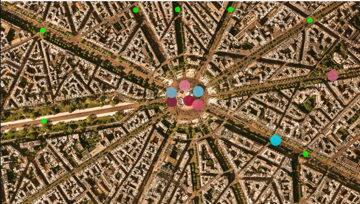

# CPPND: Program a Concurrent Traffic Simulation Part L3_Project Mutexes and Locks

This is the project for the fourth course in the [Udacity C++ Nanodegree Program](https://www.udacity.com/course/c-plus-plus-nanodegree--nd213): Concurrency. 

Throughout the Concurrency course, you have been developing a traffic simulation in which vehicles are moving along streets and are crossing intersections. However, with increasing traffic in the city, traffic lights are needed for road safety. Each intersection will therefore be equipped with a traffic light. In this project, you will build a suitable and thread-safe communication protocol between vehicles and intersections to complete the simulation. Use your knowledge of concurrent programming (such as mutexes, locks and message queues) to implement the traffic lights and integrate them properly in the code base.

## Dependencies for Running Locally
* cmake >= 2.8
  * All OSes: [click here for installation instructions](https://cmake.org/install/)
* make >= 4.1 (Linux, Mac), 3.81 (Windows)
  * Linux: make is installed by default on most Linux distros
  * Mac: [install Xcode command line tools to get make](https://developer.apple.com/xcode/features/)
  * Windows: [Click here for installation instructions](http://gnuwin32.sourceforge.net/packages/make.htm)
* OpenCV >= 4.1
  * The OpenCV 4.1.0 source code can be found [here](https://github.com/opencv/opencv/tree/4.1.0)
* gcc/g++ >= 5.4
  * Linux: gcc / g++ is installed by default on most Linux distros
  * Mac: same deal as make - [install Xcode command line tools](https://developer.apple.com/xcode/features/)
  * Windows: recommend using [MinGW](http://www.mingw.org/)

## Basic Build Instructions

1. Clone this repo.

2. Make a build directory in the top level directory: `mkdir build && cd build`

3. Compile: `cmake .. && make`

4. Run it: `./traffic_simulation`

## when neccessary : 

`sudo apt-get update`

`sudo apt-get install -y libopencv-dev`

## change a window size:
in src/Graphics.cpp:70 change the windows size `cv::resizeWindow(_windowName, 600, 600);`

## Project Tasks

When the project is built initially, all traffic lights will be green. When you are finished with the project, your traffic simulation should run with red lights controlling traffic, just as in the .gif file above. See the classroom instruction and code comments for more details on each of these parts. 

- **Task L3.1** : In class WaitingVehicles, safeguard all accesses to the private members _vehicles and _promises with an appropriate locking mechanism, that will not cause a deadlock situation where access to the resources is accidentally blocked.

- **Task L3.2** : Add a static mutex to the base class TrafficObject (called _mtxCout) and properly instantiate it in the source file. This mutex will be used in the next task to protect standard-out.

- **Task L3.3** : In method Intersection::addVehicleToQueue and in Vehicle::drive() ensure that the text output locks the console as a shared resource. Use the mutex _mtxCout you have added to the base class TrafficObject in the previous task. Make sure that in between the two calls to std::cout at the beginning and at the end of addVehicleToQueue the lock is not held.
